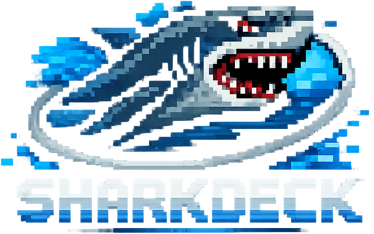

<p align="center">
  
</p>

<p align="center"><strong>Game trainers on Steam Deck, no terminal required.</strong></p>

<p align="center">
  <a href="https://github.com/tekkenfreya/SharkDeck/releases/latest/download/SharkDeck.zip">
    
  </a>
</p>

---

## What is SharkDeck?

SharkDeck lets you search, download, and run game trainers (cheats) on your Steam Deck — entirely from the UI, no terminal needed.

It comes with **CheatBoard**, a keyboard overlay that sends trainer hotkeys (F1-F12, numpad, etc.) so you can activate cheats without a keyboard.

## Install

1. Download and extract the ZIP to your Steam Deck
2. Double-click **`Install SharkDeck.desktop`**
3. Restart Steam
4. **SharkDeck** and **CheatBoard** appear in your Steam library

That's it. The daemon runs in the background and auto-starts on boot.

## How to Use

### Enable a Trainer
1. Launch **SharkDeck** from your Steam library
2. Search for your game
3. Pick a trainer and tap **Enable**
4. Launch your game — the trainer starts automatically

### Activate Cheats
1. While in-game, press the **Steam button**
2. Switch to **CheatBoard**
3. Tap the hotkey buttons (F1, Num1, etc.) to toggle cheats
4. Switch back to your game

## Uninstall

Run in Konsole:
```bash
systemctl --user stop sharkdeck && systemctl --user disable sharkdeck && rm -rf ~/.local/bin/sharkdeck-* ~/.local/bin/cheatboard-* ~/.config/sharkdeck* ~/.config/cheatboard* ~/.local/share/sharkdeck ~/.config/systemd/user/sharkdeck.service && systemctl --user daemon-reload
```

## Requirements

- Steam Deck (SteamOS 3.x)
- Google Chrome Flatpak (pre-installed on SteamOS)

---

<p align="center"><sub>Made by <a href="https://github.com/tekkenfreya">tekkenfreya</a></sub></p>
